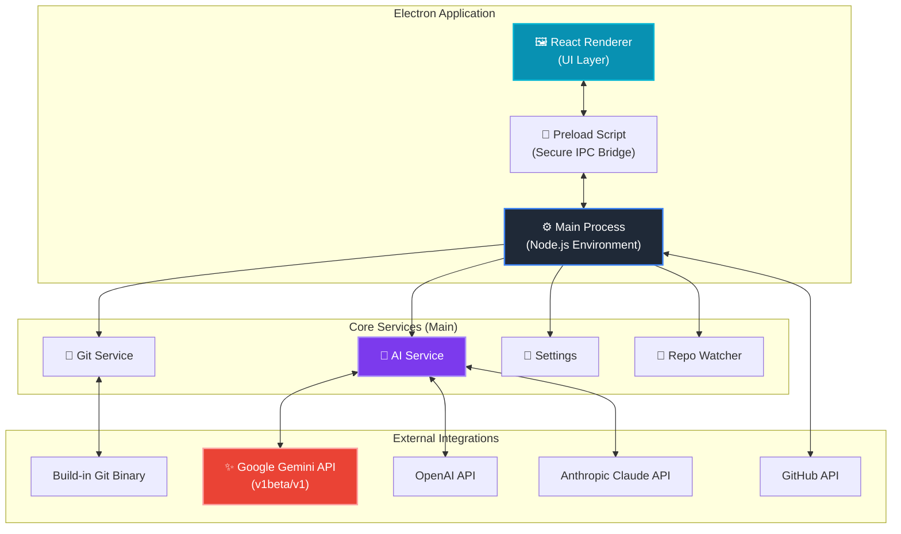

<div align="center">


# GitCanopy: Git Visualization Client designed for Professional Engineers

Transform complex commit histories into stable, readable graphs with a hyper-minimalist, lightning-fast workflow.

[](https://github.com/TainYanTun/GitCanopy/releases)
[](https://github.com/TainYanTun/GitCanopy/actions)
[](LICENSE)
[](https://github.com/TainYanTun/GitCanopy)

**The Architectural Spine of the Repository**


[Features](#-features) • [Download](#-download) • [Usage](#-usage) • [Roadmap](#-roadmap) • [Contributing](#-contributing)


</div>

---

## ✨ Features

- **Visualization Engine:** Lane-persistent commit graphs with semantic coloring and lineage tracing.
- **Actions Explorer:** Real-time GitHub Actions monitoring with instant sync and branch filtering.
- **Professional Performance:** 60FPS virtualized rendering and background worker-powered layouts.
- **Seamless Workflow:** Atomic staging, high-fidelity diffs, and integrated remote synchronization.
- **Deep Insights:** Contributor metrics, file hotspots, and a visual stash gallery with file previews.

---

## 📦 Download

GitCanopy is an open-source project hosted on GitHub. You can find the latest installers for macOS, Windows, and Linux on our **Releases** page:

👉 **[Download GitCanopy from GitHub](https://github.com/TainYanTun/GitCanopy/releases)**

> **Note for macOS users:** Since the app is currently unsigned, you will need to **Right-Click > Open** the first time you launch it to bypass the security verification.
>
> If you see a message saying **"GitCanopy is damaged and can't be opened"**:
> 1. Open your Terminal.
> 2. Run the following command:
    ```bash
    sudo xattr -cr /Applications/GitCanopy.app
    ```
    *(Replace `/Applications/GitCanopy.app` with the actual path if you installed it elsewhere)*

> **Note on Trust:** If you are uncomfortable running this command or do not trust the binary, we completely understand. As an open-source project, you are always free to audit the code and **build from source** by following our [Setup Guide](setup.md).

### 🛠️ Development Setup
For developers looking to build from source or contribute, please refer to the [Setup Guide](setup.md).

---

## 🎮 Usage

- **Open Repository:** Click the button on the welcome screen or use `⌘ + O` / `Ctrl + O`.
- **Explore History:** Navigate the interactive **Graph** or search through the **Commit History**.
- **Manage Changes:** Stage, commit, and push your work from the **Changes View**.
- **Analyze Activity:** Use **Team Insights** and **File Hotspots** to track contributor impact.

> 💡 See [Full Documentation](documentation.md) for more advanced features.

---

## 🏗️ System Architecture

GitCanopy leverages a modern, type-safe stack designed for security, performance, and AI-enhanced productivity.



### 🧠 AI Integration Flow

1.  **Renderer** sends a request (e.g., "Generate Commit Message") via IPC.
2.  **Main Process** captures the current context (staged diffs, conflict markers).
3.  **AI Service** constructs a prompt and selects the provider (Gemini 2.5/2.0, OpenAI, or Claude) based on user settings.
4.  **External API** processes the request and returns semantic text or code.
5.  **Response** flows back to the UI for user review.

### Technology Stack

<table>
<tr>
<td><strong>Runtime</strong></td>
<td>Electron with isolated renderer and secure IPC</td>
</tr>
<tr>
<td><strong>Frontend</strong></td>
<td>React + TypeScript + Tailwind CSS (Zed-inspired theme)</td>
</tr>
<tr>
<td><strong>AI Engine</strong></td>
<td>Google Gemini 2.5 Flash / 2.0 Flash (Primary), OpenAI, Claude</td>
</tr>
<tr>
<td><strong>Visualization</strong></td>
<td>D3.js with Web Worker computation</td>
</tr>
<tr>
<td><strong>Git Integration</strong></td>
<td>Native binary interaction with memory-safe buffers</td>
</tr>
</table>

---

## 🗺️ Roadmap

- [ ] **Visual Interactive Rebase:** Drag-and-drop history management and rewriting.
- [ ] **Conflict Resolution UI:** Advanced tools for solving complex merges.
- [ ] **Ecosystem Integration:** First-class support for GitHub, GitLab, and Bitbucket.
- [ ] **Extensibility:** Custom themes and commit classification plugin system.

---

## 🤝 Contributing

Everyone is welcome for contributions from the community! Whether it's bug reports, feature requests, or code contributions, every bit helps make GitCanopy better. Refer to our [Development Guide](setup.md) to get started.

---

## 💖 Support the Project

GitCanopy is a solo developer project built with passion. If you find it useful, please consider supporting its growth:

- ⭐ **Star this repository** to help others discover the project.
- 🚀 **Share GitCanopy** with your team or on social media.
- 🤝 **[Sponsor the Developer](https://github.com/sponsors/TainYanTun)** on GitHub.

---

## 📄 License

Distributed under the **MIT License**. See [`LICENSE`](LICENSE) for more information.

```
MIT License - feel free to use GitCanopy in your projects,
modify it, and distribute it as you see fit.
```

---

<div align="center">

{ [Report Bug](https://github.com/TainYanTun/GitCanopy/issues/new?template=bug_report.md) • [Request Feature](https://github.com/TainYanTun/GitCanopy/issues/new?template=feature_request.md) • [Documentation](documentation.md) }

</div>
