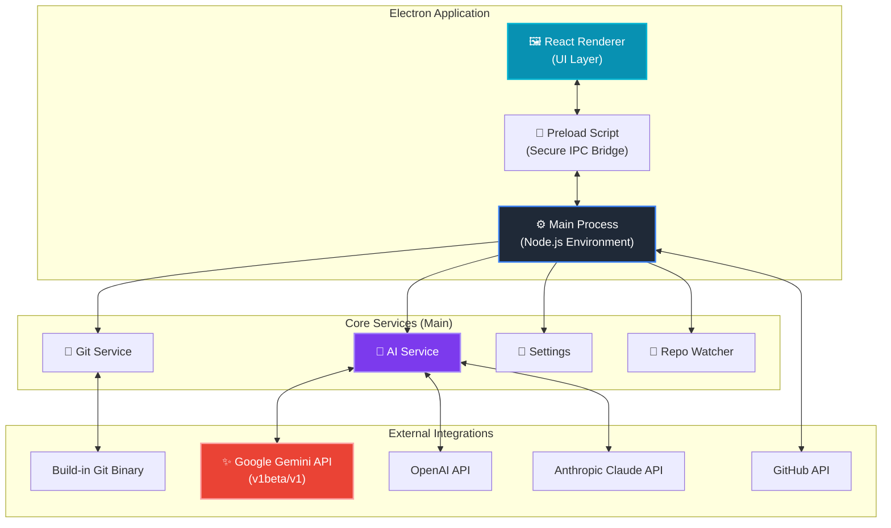

<div align="center">


# GitCanopy: The Intelligent Git Client for Professional Engineers

**Stop managing Git. Start engineering.** 
GitCanopy combines high-performance visualization with a cognitive AI engine to automate commit hygiene, resolve complex conflicts, and audit code quality in real-time.

[](https://github.com/TainYanTun/GitCanopy/releases)
[](documentation.md)
[](https://github.com/TainYanTun/GitCanopy/actions)
[](LICENSE)

[Features](#-features) • [Download](#-download) • [Usage](#-usage) • [System Architecture](#-system-architecture)


</div>

---

## 🧠 Why GitCanopy is Smart

GitCanopy isn't just a wrapper around `git`. It is an **active development partner** that understands your code.

### 🛡️ Proactive Quality Control
Most clients let you push bad code. GitCanopy's **AI Code Reviewer** analyzes your staged diffs against security best practices and performance standards, giving you a **Quality Score (0-100)** before you ever hit commit.

### ✨ AI Command Center (Arc-style CLI)
Stop memorizing complex Git flags. Press `⌘J` to open a centered, immersive command palette. Type your intent in plain English (e.g., *"undo my last commit but keep changes"* or *"delete branches already merged into main"*) and the AI will translate and execute the command safely.

### 🕰️ Git Time Machine
History is a living thing. Use the **Time Machine** scrubber to travel back to any point in your project's life. The graph visualization rebuilds itself dynamically, allowing you to see how your architecture sprouted and merged over years or minutes.

---

## ✨ Features

- **🤖 AI & Automation:**
    - **AI Command Center (⌘J):** Centered, Spotlight-style natural language CLI for repository management.
    - **Smart Commit Generator:** Generate semantic messages from diffs using Gemini, OpenAI, or Claude.
    - **Intelligent Conflict Resolver:** Resolve complex merge conflicts with natural language instructions.
    - **AI Code Reviewer:** Get a pre-commit quality score (0-100) and catch security bugs before you push.
- **Visualization Engine:** 
    - **Railway-Style Graph:** Lane-persistent commit graphs with semantic coloring.
    - **Git Time Machine:** Interactive historical scrubber to visualize repo evolution over time.
- **Actions Explorer:** Real-time GitHub Actions monitoring with instant sync and branch filtering.
- **Professional Performance:** 60FPS virtualized rendering and background worker-powered layouts.
- **Seamless Workflow:** Atomic staging, high-fidelity diffs, and integrated remote synchronization.
- **Deep Insights:** Contributor metrics, file hotspots, and a visual stash gallery with file previews.

---

## 📦 Download

GitCanopy is an open-source project hosted on GitHub. You can find the latest installers for macOS, Windows, and Linux on our **Releases** page:

👉 **[Download GitCanopy from GitHub](https://github.com/TainYanTun/GitCanopy/releases)**

> **Note for macOS users:** Since the app is currently unsigned, you will need to **Right-Click > Open** the first time you launch it to bypass the security verification.
>
> If you see a message saying **"GitCanopy is damaged and can't be opened"**:
> 1. Open your Terminal.
> 2. Run the following command:
    ```bash
    sudo xattr -cr /Applications/GitCanopy.app
    ```

### 🛠️ Development Setup
For developers looking to build from source or contribute, please refer to the [Setup Guide](setup.md).

---

## 🏗️ System Architecture

GitCanopy leverages a modern, type-safe stack designed for security, performance, and AI-enhanced productivity.



### 🧠 AI Integration Flow

1.  **Renderer** sends a request (e.g., "Generate Commit Message") via IPC.
2.  **Main Process** captures the current context (staged diffs, conflict markers).
3.  **AI Service** constructs a prompt and selects the provider (Gemini 2.5/2.0, OpenAI, or Claude) based on user settings.
4.  **External API** processes the request and returns semantic text or code.
5.  **Response** flows back to the UI for user review.

---

## 🗺️ Roadmap

- [ ] **Visual Interactive Rebase:** Drag-and-drop history management and rewriting.
- [ ] **Conflict Resolution UI:** Advanced tools for solving complex merges.
- [ ] **Ecosystem Integration:** First-class support for GitHub, GitLab, and Bitbucket.
- [ ] **Extensibility:** Custom themes and commit classification plugin system.

---

## 🤝 Contributing

Everyone is welcome for contributions from the community! Whether it's bug reports, feature requests, or code contributions, every bit helps make GitCanopy better. Refer to our [Development Guide](setup.md) to get started.

---

## 💖 Support the Project

GitCanopy is a solo developer project built with passion. If you find it useful, please consider supporting its growth:

- ⭐ **Star this repository** to help others discover the project.
- 🚀 **Share GitCanopy** with your team or on social media.
- 🤝 **[Sponsor the Developer](https://github.com/sponsors/TainYanTun)** on GitHub.

---

## 📄 License

Distributed under the **MIT License**. See [`LICENSE`](LICENSE) for more information.

```
MIT License - feel free to use GitCanopy in your projects,
modify it, and distribute it as you see fit.
```

---

<div align="center">

{ [Report Bug](https://github.com/TainYanTun/GitCanopy/issues/new?template=bug_report.md) • [Request Feature](https://github.com/TainYanTun/GitCanopy/issues/new?template=feature_request.md) • [Documentation](documentation.md) }

</div>