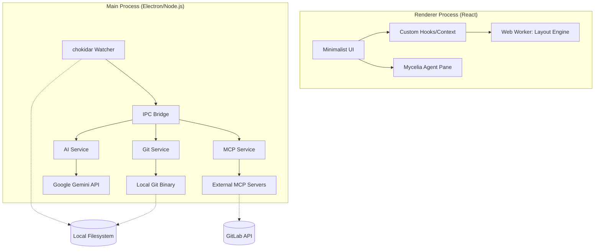

# GitCanopy Documentation

GitCanopy is a hyper-minimalist, high-performance Git visualizer and client designed for professional engineers. It transforms the traditional Git client into an intelligent development partner by deeply integrating **Google Gemini** into the core version control lifecycle.

---

## 🧠 The Cognitive Engine

GitCanopy is built around the philosophy that **tools should understand code, not just text**. I leverage the Gemini 3 model (and support OpenAI/Claude) to provide three distinct cognitive services:

### 1. Quality Reviewer (Pre-Commit Audit)
Before you commit code, GitCanopy acts as a virtual Senior Engineer. It scans your staged diffs and generates a comprehensive quality report.

*   **Quality Score (0-100):** A heuristic metric based on logic, stability, and maintainability.
*   **Bug Detection:** Identifies logical fallacies, potential null reference exceptions, and race conditions.
*   **Performance:** Highlights suboptimal loops or heavy computations.
*   **Clean Code:** Checks architectural integrity and style consistency.

### 2. Semantic Context Extraction
GitCanopy parses raw code changes to extract the "intent" behind a delta. It ignores whitespace and trivial changes to focus on the architectural impact, generating semantic commit messages that adhere to the **Conventional Commits** specification.

### 3. Instructional Conflict Resolution
Standard merge tools are "dumb"—they force you to choose between *Line A* or *Line B*. GitCanopy's **Prompted Resolver** allows for semantic merging. You can provide natural language instructions like:
> *"Combine these changes. Keep the error handling from the Incoming branch, but use the async/await pattern from the Current branch."*

The AI synthesizes a new block of code that satisfies both requirements, turning complex logic conflicts into simple prompts.

---

## 🍄 Mycelia: The Agentic Core

**Mycelia** is the next evolution of GitCanopy's AI integration. While previous versions focused on passive assistance (summaries, reviews), Mycelia is an **active agent** capable of executing complex workflows by connecting your local environment to external platforms.

### 1. Model Context Protocol (MCP) Support
Mycelia is built on the **Model Context Protocol**, an open standard that allows AI models to safely and structuredly interact with external tools. 
- **Tool Discovery:** Mycelia automatically discovers available tools from connected MCP servers.
- **Dynamic Execution:** Using LLM reasoning, Mycelia determines which tools to call, what parameters are needed, and how to sequence them to fulfill your request.

### 2. GitLab Agent Integration
Version 1.3.0 introduces native support for **GitLab**. By linking your account, Mycelia becomes your personal GitLab operator:
- **Issue Management:** Query, create, and comment on issues without leaving the app.
- **Merge Requests:** Inspect MR status, review changes, and manage approvals.
- **CI/CD Control:** Trigger pipelines and monitor build status via natural language.

### 3. Agentic Chat Interface
Access the Mycelia pane to engage in a context-aware dialogue.
- **Natural Language Intents:** "What's the status of the login-fix issue on GitLab?" or "Create a new issue for the bug I just found."
- **Short-term Memory:** Mycelia maintains conversation context throughout your active session, allowing for follow-up questions and complex, multi-turn reasoning.
- **Professional Summarization:** Mycelia doesn't just show raw JSON. It uses your configured AI provider to transform tool outputs into structured, beautiful Markdown reports.
- **Standardized Loading States:** High-fidelity spinners and skeleton loaders provide real-time feedback during long-running agentic tasks.

---

## 🏗 Architecture Overview

---

## 🤖 AI Assistant Guide

GitCanopy supports **Gemini** (Primary), **OpenAI**, and **Claude** as backend providers.

### 1. Configuration
Go to **Settings (⌘,)** and navigate to the **AI Assistant** tab.
- **Provider:** Select Google Gemini (Recommended).
- **Model:** Choose from a wide range of models including `gemini-2.0-flash`, `gemini-1.5-pro`, and more.
- **API Key:** Enter your key (it will be encrypted on disk).

### 2. Mycelia & MCP Setup
1. Enable the **Mycelia Agent** in the sidebar.
2. Configure your MCP server endpoints (e.g., GitLab) in the Settings panel.
3. Mycelia will automatically handshake with these servers to learn their capabilities.

### 3. Quality Reviewer
Before you commit, click the purple **"Quality Review"** button in the Source Control header.
- **Score:** You will receive a score from 0-100. Aim for >90.
- **Analysis:** Review the categorized issues.
    - 🐛 **Bugs:** Logic errors or potential crashes.
    - ⚡ **Optimization:** Performance bottlenecks.
    - 🎨 **Style:** Code consistency and clean principles.

### 4. Smart Commit Generation
1. Stage your files.
2. Click the **Robot Icon** next to the commit message input.
3. The AI will generate a Summary and Description based on the *intent* of your changes, not just the file names.

### 5. AI Command Bar (Natural Language CLI)
The flagship feature of GitCanopy. Press `⌘J` to open a centered, Arc-style command palette. Type any Git intent in plain English, and the AI will translate it into a safe Git command for execution.
- **Intent-Based:** "Switch to my work on the header" or "Undo my last commit."
- **Context-Aware:** Understands your current branch and repository state.

### 6. Smart Conflict Resolution
When a merge conflict occurs:
1. Click the conflicted file in the Changes view.
2. You will see a 3-pane view: Current, Incoming, and Result.
3. **The Magic:** In the "AI Instruction" box at the bottom, type naturally.
4. Click **Resolve with AI**.

---

## 🚀 Key Features

### 1. Unified Visual History
- **Railway-Style Graph:** Maps the Directed Acyclic Graph (DAG) of your repository onto a stable, multi-lane grid.
- **Edit Mode & Marquee Selection (V):** Switch to Select mode to draw a marquee box over multiple commits. This activates the bulk action bar for squashing and hash copying.
- **Git Time Machine:** A temporal scrubber that allows you to rebuild the graph visualization at any point in history.
- **Virtualized Rendering:** Optimized to handle enterprise-scale repositories (10,000+ commits) without UI lag.
- **Semantic Coloring:** Instantly distinguish between features, fixes, refactors, and merges based on commit message prefixes.

### 2. Working Tree Management
- **Uncommitted Changes View:** A dedicated tab to view modified, added, and untracked files.
- **Unified Diff Viewer:** Professional-grade diff interface with line numbers, hunk headers, and syntax-aware highlighting.
- **Stage & Commit:** Seamless GUI workflow for staging files and creating new commits.
- **Push to Remote:** One-click synchronization with your remote server when your local branch is ahead.

### 3. CI/CD & Insights
- **GitHub Actions Explorer:** Live monitoring of CI/CD pipelines with real-time status updates and manual refresh capability.
- **Stash Gallery:** A visual interface for managing git stashes, featuring an **Expandable Preview** to inspect affected files before applying.
- **Team Metrics:** Analyze contributor impact, commit frequency, and activity over time.
- **Hotspots:** Identify high-churn files that are frequently modified.

---

## 🛠 Usage Guide

### Opening a Repository
- Launch GitCanopy and click **Open Repository**.
- Select any folder containing a `.git` directory.
- Your most recent repositories will appear on the Welcome Screen for quick access.

### Navigation
- Use the **Status Bar** (bottom) to switch between:
  - **Graph View:** The primary visual DAG.
  - **Commit History:** A searchable, virtualized list of all commits.
  - **Changes:** Your current working directory status.
  - **Actions:** Live GitHub Actions monitoring (requires Personal Access Token).
  - **Insights:** Contributor and file hotspots.
  - **Checkout (Cmd+B):** Safe branch switching with spotlight search.

### Committing Changes
1. Go to the **Changes** tab.
2. Hover over a file in the "Working Directory" and click `+` to stage it.
3. Enter a concise commit message in the text area at the bottom.
4. Click **Commit** (or press `⌘Enter`).

---

## ⌨️ Keyboard Shortcuts

| Shortcut | Action |
| :--- | :--- |
| `⌘ + O` | Open Repository |
| `⌘ + B` | Spotlight Branch Switcher |
| `⌘ + J` | AI Command Center |
| `⌘ + R` | Refresh / Sync Data |
| `V` | Select Mode (Marquee) |
| `H` | Pan Mode (Navigation) |
| `Esc` | Close Panels / Clear Selection |
| `⌘ + C` | Copy Selected Hashes |
| `⌘ + Enter` | Execute Commit (when in Changes view) |

---

## 🛡 Security & Performance

### Security Boundaries
- **Anti-Injection:** All Git commands are executed using safe argument arrays and the `--` separator to prevent flag injection.
- **Encrypted Storage:** GitHub and AI API Keys are encrypted using OS-level safe storage (Keychain/DPAPI).
- **Hardened URL Parsing:** Strict hostname verification for GitHub remotes to prevent SSRF and malicious redirection.
- **Electron Hardening:** Strict `contextIsolation` and `webSecurity` settings. External navigation is disabled by default.

### Performance Architecture
- **Web Worker Layout:** Graph layout calculations are performed off-thread to ensure zero-stutter navigation.
- **Memory Safety:** A 20MB safety buffer is applied to all Git output streams to prevent memory exhaustion on massive diffs.
- **Read-Write Locking:** Custom concurrency system that allows parallel read operations while safely serializing writes.
- **List Virtualization:** Uses `react-window` to ensure only visible rows are rendered in the DOM, maintaining 60FPS scrolling.

---

## 🎨 Philosophy
GitCanopy is built on the principle of **"Developer First"** and prioritize speed and data density over decorative UI elements. Every pixel should serve a functional purpose.

**Build Version:** 1.3.0 Stable
**Platform:** macOS / Windows / Linux
