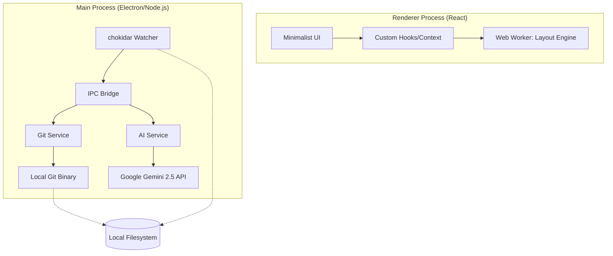

# GitCanopy Documentation

GitCanopy is a hyper-minimalist, high-performance Git visualizer and client designed for professional engineers. Inspired by the ZED editor aesthetic, it focuses on architectural clarity, lightning-fast interactions, and robust security.

---

## 🏆 Hackathon Submission: Gemini 2.5 Integration

**GitCanopy** transforms the traditional Git client into an intelligent development partner by deeply integrating **Gemini 2.5 Flash** into the core version control lifecycle. We leveraged three distinct Gemini features to solve common developer friction points:

1.  **Semantic Context Extraction:** GitCanopy uses Gemini 2.5 to analyze staged diffs and generate semantic commit messages following the Conventional Commits specification. By processing raw code changes, the model extracts the "intent" behind the delta, ensuring high-quality, searchable project history without manual overhead.
2.  **Instructional Conflict Resolution:** We innovated on standard auto-merging by implementing a "Prompted Resolver." Developers can provide natural language hints (e.g., *"preserve the new auth logic but keep the legacy variable naming for compatibility"*) which Gemini interprets to perform semantic merges that standard line-by-line diff engines cannot handle.
3.  **Architectural Insights:** The **AI Insight** engine analyzes entire commit deltas to provide high-level summaries of architectural impact. It identifies potential risks and explains complex changes in plain English, serving as an automated "first pass" code reviewer.

By utilizing Gemini 2.5 Flash’s high context window and low latency, GitCanopy delivers a hyper-responsive experience that makes AI an essential, rather than decorative, part of the engineering workflow.

---

## 🏗 Architecture Overview

### 🧠 How we use Gemini 2.5
GitCanopy leverages the **Gemini 2.5 Flash** model for three critical developer workflows:

1.  **Semantic Context Extraction:** We feed Git diffs into Gemini to generate "Conventional Commits" messages. The model is tuned to respect the 72-character summary limit and provide meaningful bullet points.
2.  **Prompted Conflict Resolution:** Unlike standard auto-mergers, we allow users to provide "Merge Hints." Gemini interprets these instructions to perform semantic merges that preserve logic from both branches based on developer intent.
3.  **Security Filtering:** (Future) Pre-push analysis to detect potential secret leakages beyond simple filename checks.

---

## 🚀 Key Features

### 1. Unified Visual History
- **Railway-Style Graph:** Maps the Directed Acyclic Graph (DAG) of your repository onto a stable, multi-lane grid.
- **Virtualized Rendering:** Optimized to handle enterprise-scale repositories (10,000+ commits) without UI lag.
- **Semantic Coloring:** Instantly distinguish between features, fixes, refactors, and merges based on commit message prefixes.

### 2. Working Tree Management
- **Uncommitted Changes View:** A dedicated tab to view modified, added, and untracked files.
- **Unified Diff Viewer:** Professional-grade diff interface with line numbers, hunk headers, and syntax-aware highlighting.
- **Stage & Commit:** Seamless GUI workflow for staging files and creating new commits.
- **Push to Remote:** One-click synchronization with your remote server when your local branch is ahead.

### 3. AI-Powered Workflow
- **Semantic Commit Generation:** Automatically analyze staged changes and generate professional, Conventional Commit messages.
- **Intelligent Conflict Resolver:** Solve merge conflicts using AI that understands your code logic. Provide custom instructions (e.g., "prefer their styling but my logic") for precise resolutions.
- **Minimalist Prompt Bar:** A dedicated command area within conflict blocks for direct AI interaction.

### 4. CI/CD & Insights
- **GitHub Actions Explorer:** Live monitoring of CI/CD pipelines with real-time status updates and manual refresh capability.
- **Stash Gallery:** A visual interface for managing git stashes, featuring an **Expandable Preview** to inspect affected files before applying.
- **Team Metrics:** Analyze contributor impact, commit frequency, and activity over time.
- **Hotspots:** Identify high-churn files that are frequently modified.

---

## 🛠 Usage Guide

### Opening a Repository
- Launch GitCanopy and click **Open Repository**.
- Select any folder containing a `.git` directory.
- Your most recent repositories will appear on the Welcome Screen for quick access.

### Configuration
Go to **Settings (⌘,)** to configure your environment:
- **General:** Set your Git Identity (`user.name` and `user.email`) to ensure your commits are correctly attributed.
- **AI Assistant:** Configure your Gemini API Key and provider settings.
- **GitHub:** Securely store your Personal Access Token for private repo access and Actions monitoring.

### Navigation
- Use the **Status Bar** (bottom) to switch between:
  - **Graph View:** The primary visual DAG.
  - **Commit History:** A searchable, virtualized list of all commits.
  - **Changes:** Your current working directory status.
  - **Actions:** Live GitHub Actions monitoring (requires Personal Access Token).
  - **Insights:** Contributor and file hotspots.
  - **Checkout (Cmd+B):** Safe branch switching with spotlight search.

### Committing Changes
1. Go to the **Changes** tab.
2. Hover over a file in the "Working Directory" and click `+` to stage it.
3. Enter a concise commit message in the text area at the bottom.
4. Click **Commit** (or press `⌘Enter`).

---

## ⌨️ Keyboard Shortcuts

| Shortcut | Action |
| :--- | :--- |
| `⌘ + O` | Open Repository |
| `⌘ + B` | Spotlight Branch Switcher |
| `⌘ + R` | Refresh / Sync Data |
| `Esc` | Close Panels / Clear Selection |
| `⌘ + Enter` | Execute Commit (when in Changes view) |

---

## 🛡 Security & Performance

### Security Boundaries
- **Anti-Injection:** All Git commands are executed using safe argument arrays and the `--` separator to prevent flag injection.
- **Encrypted Storage:** GitHub Personal Access Tokens are encrypted using OS-level safe storage (Keychain/DPAPI).
- **Hardened URL Parsing:** Strict hostname verification for GitHub remotes to prevent SSRF and malicious redirection.
- **Electron Hardening:** Strict `contextIsolation` and `webSecurity` settings. External navigation is disabled by default.

### Performance Architecture
- **Web Worker Layout:** Graph layout calculations are performed off-thread to ensure zero-stutter navigation.
- **Memory Safety:** A 20MB safety buffer is applied to all Git output streams to prevent memory exhaustion on massive diffs.
- **Read-Write Locking:** Custom concurrency system that allows parallel read operations while safely serializing writes.
- **List Virtualization:** Uses `react-window` to ensure only visible rows are rendered in the DOM, maintaining 60FPS scrolling.

---

## 🎨 Philosophy
GitCanopy is built on the principle of **"Developer First"** and prioritize speed and data density over decorative UI elements. Every pixel should serve a functional purpose.

**Build Version:** 1.1.0 Stable
**Platform:** macOS (not recommended) / Windows / Linux
